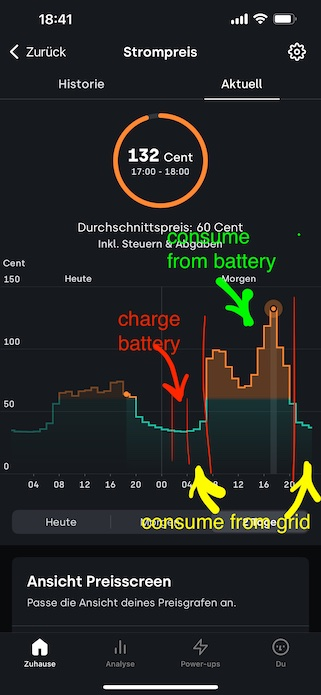

# Sungrow + Tibber to save money 💴 (and the planet) 🌍

## Goal
Charge your home battery in cheap Tibber hours, consume from the grid in average price times, consume from home battery in expensive hours.

.

## Manual Alternative
At first I used the Sungrow app iSolarCloud. I manually scheduled time windows to charge and discharge. Look for Forced Charging, Battery Use Time, Weekend Discharging in the app

## Prerequisites
* https://github.com/mkaiser/Sungrow-SHx-Inverter-Modbus-Home-Assistant
* https://www.home-assistant.io/integrations/tibber

## Simulate first
Create the automation [automation-simulate.yaml](automation-simulate.yaml). Have no fear since for now it only posts notifications to your Home Assistant UI, we will extend this simulation mode with real action in next section. To install, create a new Automation in the UI, switch to yaml view, and copy&paste. If you want to learn more about creating Automations, [read the documentation](https://www.home-assistant.io/docs/automation/editor/).

## Action!
Make your automation do something by calling the scripts that come with the Sungrow modbus integration from the Prerequisites section: [automation-productive.yaml](automation-productive.yaml). If you want to debug it, you can check the Traces of your Automation.

## Add further conditions to refine
Here is [automation-extended.yaml](automation-extended.yaml) with the following extensions:
* I realized, the battery is not charged while in bypass mode, so I use the already existing sensor `exporting_power` as trigger.
* And I realized in some weeks I do not want to charge my battery from the grid, the sun delivers enough if I consume from the battery only in expensive hours, so I added a toggle `battery_recharge_when_cheap_tibber_price`

## You don't have Tibber yet? \[affiliate links\]
* English short version:
  * Use my invite code https://invite.tibber.com/r664wqgc
  * And if you are looking for an ecological gas supplier have a look at https://www.polarstern-energie.de/entdecke-polarstern/?rc=6H5ZZZN4 
* German long version:
  * Strom ist immer dann billig, wenn besonders viel Solar und Windstrom im Netz ist. Doppelter Nutzen also! Du kannst Geld sparen, die Umwelt schonen und gleichzeitig unnötigen Energieverbrauch vermeiden. Wie das geht? Mit den stundenaktuellen Strompreisen von Tibber kannst du deinen Verbrauch einfach auf die günstigsten Stunden verlagern und teure Stunden vermeiden. Probiere es aus, und wir bekommen beide 50 € als Bonus, den wir im Tibber Store einlösen können. ⚡ Lies hier mehr dazu: https://invite.tibber.com/r664wqgc
  * Und falls bei dir wie bei mir keine Wärmepumpe geht, dann gibt es 100% Ökogas. Polarstern ist ein unabhängiger Ökoenergieversorger, den ich dir ans Herz legen möchte. Die bieten nur saubere Energie, fördern die Energiewende weltweit und sind von der Gemeinwohl-Ökonomie zertifiziert. Ich find's super. Und der Wechsel ist in wenigen Minuten erledigt - wirklich! Mit meinem Empfehlungscode BC3578BV bekommst du außerdem einen Willkommensbonus von 20 Euro auf deine erste Jahresrechnung. Schau sie dir gerne mal an. https://www.polarstern-energie.de/entdecke-polarstern/?rc=6H5ZZZN4
